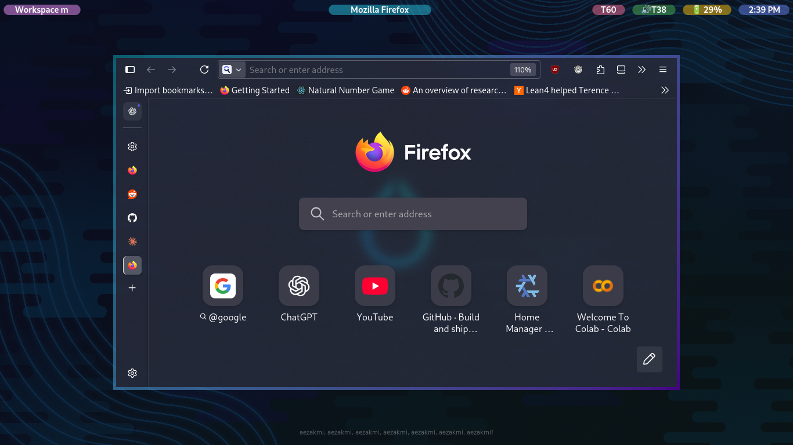

# 🚀 GTK Status Bar

A modern, transparent status bar for Wayland compositors built directly in Rust with GTK4 and layer-shell protocol. Designed for Hyprland with real-time workspace tracking, PipeWire audio monitoring, and async event handling.

Select a specific output by its connector name when starting the bar:

```sh
gtk-status-bar --monitor DVI-I-1
```

Without `--monitor`, the compositor chooses the output.

Network reachability defaults to Cloudflare DNS targets and can be tuned with
repeatable `--network-ping-target ADDRESS` arguments. The randomized adaptive
policy defaults to a 60-second mean while healthy, a 1-second mean after link or
probe instability, and 15 seconds of failures across every configured target
before reporting an outage. Run `gtk-status-bar --help` for every timing option.

Link type, route changes, roaming, and Wi-Fi strength come from NetworkManager
D-Bus events. ICMP probes are used only for upstream Internet reachability,
which cannot be inferred from a working local link. Weak Wi-Fi and elevated
latency shorten the next randomized interval; healthy wired and strong Wi-Fi
connections return to the stable mean.

## 📸 Screenshot



## ✨ Features

- **🎯 Direct GTK4 implementation** - No middleware like eww, built directly on GTK
- **⚡ No polling design** - Event-driven architecture for blazingly fast performance
- **🎵 Default audio device focus** - PipeWire integration that tracks only the system's default sink
- **🎨 Workspace color coding** - Title widget background changes color based on current workspace
- **📱 Multiple Bluetooth devices** - Shows connected mice, speakers, earbuds with battery info via D-Bus monitoring (TODO: verify multiple device support)
- **🔋 Smart widget visibility** - Battery/Bluetooth widgets hide when no data, title always visible for centering
- **🐧 Native Wayland support** - Layer-shell protocol with Hyprland integration, future DE support planned
- **🌟 Snappy, colorful, transparent** - Clean aesthetic with responsive visual feedback
- **🔒 Thread-safe architecture** - Proper async/sync bridge between system events and GTK main thread
- **🎨 CSS customization** - External CSS file support for complete visual customization
- **📡 D-Bus integration** - Direct system service communication for real-time updates
- **🧰 System tray host** - StatusNotifierItem support for Electron, OBS, Fcitx, and other tray applications
- **🔧 Resilient error handling** - Uses anyhow for graceful degradation and continuous operation
- **📝 Extensive logging** - Comprehensive tracing throughout the application for debugging

## 📦 Components

- 🖥️ Live workspace display with custom name support
- ⏰ Real-time clock with 12-hour format
- 🎵 PipeWire volume monitoring with compact display format
- 📱 Bluetooth device status with battery levels
- 🔋 System battery status with automatic hiding and state-aware 🔋/🪫/⚡/🔌 icons
- 🌐 Event-driven wired/Wi-Fi status with signal strength and adaptive Internet checks
- 🧰 Clickable system tray with icon theme, file icon, and ARGB pixmap support
- 🧩 Extensible widget architecture with centered layout

System tray controls follow the StatusNotifierItem convention: left click activates an application, middle click performs its secondary action, and right click opens its context menu. Menu-only items open their menu on left click as well. Context menus are read from the application's com.canonical.dbusmenu interface and rendered by the bar itself as native popovers, since applications cannot reliably draw their own menus over a layer-shell surface.

### External tray control

The bar listens on a per-user Unix socket so keyboard daemons, compositor
bindings, and other local programs can control the tray without reproducing its
D-Bus logic. The default socket is
`$XDG_RUNTIME_DIR/gtk-status-bar/tray.sock`; set
`GTK_STATUS_BAR_SOCKET` in both processes to override it. The directory and
socket use modes `0700` and `0600`.

`trayctl` is the reference client. A target is an exact item key, an exact
title, or a zero-based index from `list`, in that priority order:

```bash
trayctl list
trayctl context-menu "Bluetooth"
trayctl keyboard-menu "Bluetooth"
trayctl menu-next "Bluetooth"
trayctl menu-previous "Bluetooth"
trayctl menu-activate "Bluetooth"
trayctl menu-click "Bluetooth" 12
trayctl close-menus
trayctl activate 0
trayctl secondary-activate 1
trayctl --json list
```

Human list output labels each item as `menu` or `activate`; JSON exposes the
same state as `item_is_menu`, allowing callers to apply menu-only behavior only
to items that advertise it.

Selection wraps at both ends. `menu-down` and `menu-up` are aliases for
`menu-next` and `menu-previous`. The newline-delimited JSON protocol also
supports persistent connections; its request verbs match the command names
above.

`keyboard-menu` starts tray-wide keyboard navigation and opens the target
item's native popover. A temporary layer-shell helper surface requests exclusive
keyboard input. The tray and current icon use a warm tint at the tray-icon level
and a cool tint while navigating inside a menu. At the tray-icon level, `h`/Left
and `l`/Right wrap across icons and automatically open the landed icon's menu.
`gg`/Home and `G`/End jump to the first and last icons.
`j`/Down or `k`/Up enters the open menu at its first or last entry. Within a
menu, `j`/`k` move between entries, `l`/Right/Enter enters a submenu, and
`h`/Left leaves it; leaving the top menu level returns to icon navigation.
Escape or `q` also returns from menu navigation to the icon level, then closes
and releases the grab when pressed again. Enter activates a leaf entry and
releases the grab. Click-away dismissal and `trayctl close-menus` also release
it, so input returns to the previously focused window. The long-lived bar,
mouse-opened menus, and ordinary socket-opened menus never request keyboard
input.

## 🛠️ Technology Stack

- **🦀 Rust** - Memory-safe systems programming with anyhow error handling
- **🎨 GTK4** - Modern Linux desktop UI toolkit with CSS styling
- **🌊 Layer Shell** - Wayland compositor integration
- **⚡ Tokio** - Async runtime with sophisticated thread management
- **🎮 Hyprland-rs** - Native Hyprland API bindings
- **🎵 PipeWire** - Modern Linux audio system integration
- **🚌 D-Bus** - System service communication for Bluetooth, battery, and NetworkManager
- **📝 Tracing** - Comprehensive structured logging system

## 🚀 Usage

This is a personal status bar tailored to my specific workflow and aesthetic preferences. You're welcome to:

- 🍴 Fork this project for your own customizations
- 📖 Use it as a reference for building GTK layer-shell applications
- 🔄 Adapt the async patterns for other Wayland/GTK projects
- 🎓 Study the implementation for learning purposes

**📝 Note:** This project is highly specific to my use case and desktop setup. While you're encouraged to fork and modify it, I likely won't accept contributions as the design decisions are very personal and opinionated.

## 🔨 Building & Running

### With Nix Flakes (Recommended)

```bash
# Run directly
nix run

# Or build and run manually
nix develop
cargo build --release
./target/release/gtk-status-bar
```

### Traditional Cargo

```bash
cargo build --release
./target/release/gtk-status-bar
```

Requires GTK4, layer-shell protocol support, and a Wayland compositor (tested with Hyprland).

## 📄 License

MIT License - see [LICENSE](LICENSE) for details.
